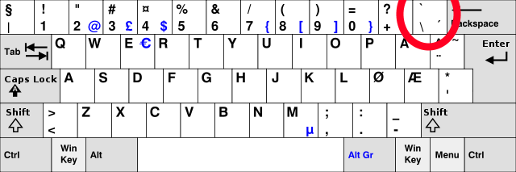
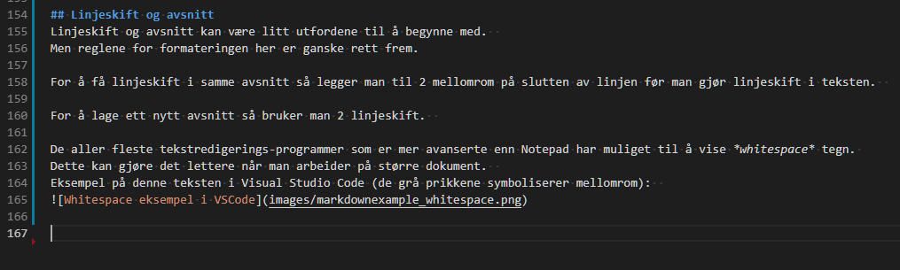

# Introduksjon til Markdown

Markdown (md) er ett tekstformaterings format tenkt på å enkelt kunne skrive dokumentasjon med en klar syntaks som kan etterbehandles av en *parser* for å skape ett rikt dokument. Men som likevel kan åpnes i ett rent tekstprogram (som for eksempel Notepad), og skal være fullt leselig der.

Det meste av dokumentasjon man finner på GitHub er basert på Markdown, inkludert alle dokumentene i dette repositoryet.  
Markdown filer har generelt filendingen ``.md``, men de de er rene tekstfiler (``.txt``).

Markdown har utviklet seg over lang tid og har mange *dialekter* men de mest brukte etter hvert er "CommonMark" (CM) og "GitHub Flavored Markdown" (GFM).  
Siden vi jobber på GitHub så er GFM det enkleste å forholde seg til, men det er nyttig å være klar over at det er forskjellige versjoner i tilfellet man kommer borti at formateringen ikke fungerer som forventet.


[GitHub Markdown hurtigreferanse](https://enterprise.github.com/downloads/en/markdown-cheatsheet.pdf) - Nyttig referanse å ha for hånden når man jobber med Markdown.

# Grunnleggende formatering
En ting som er greit å notere seg når man jobber med Markdown er at de "usynlige" tegnene gjelder for formateringen også.  
Mellomrom og linjeskift har noe å si når man formaterer teksten.

Ett enkelt eksempel er at det er forskjell på ``####Tittel`` og ``#### Tittel``:  
``####Tittel`` blir seende slik ut:  
####Tittel  
Mens ``#### Tittel`` ser slik ut:
#### Tittel

Dette er noe man blir fort vant til når man jobber med det.

## Titler (Headers)
Titler er den mest grunnleggende organiseringen av ett dokument og man har 6 forskjellige nivåer.  
I ren tekst ser de slik ut:
```Markdown
# Tittel 1
## Tittel 2
### Tittel 3
#### Tittel 4
##### Tittel 5
###### Tittel 6
```
når de er blitt formatert ser de slik ut:
# Tittel 1
## Tittel 2
### Tittel 3
#### Tittel 4
##### Tittel 5
###### Tittel 6


## Utheving av tekst
Hvis du ønsker å fremheve tekst enten med *kursiv* eller **utheving** så er det en ganske rett frem sak:  
``Hvis du ønsker å fremheve tekst enten med *kursiv* eller **utheving** så er det en ganske rett frem sak:``  
Du kan også ***kombinere*** disse:  
``Du kan også ***kombinere*** disse:``  

## Lister
Lister kan lages som *ordnede* eller *uordnede*.  
Ordnet liste:  
```Markdown
1. Punkt 1
2. Punkt 2
3. Punkt 3
```  
1. Punkt 1
2. Punkt 2
3. Punkt 3


Uordnet liste:  
```Markdown
* Punkt 1
* Punkt 2
* Punkt 3
```  
* Punkt 1
* Punkt 2
* Punkt 3

Det er også mulig å kombinere disse og lage flere nivåer (her bruker man 3 mellomrom for å få frem underpunkter).  
```Markdown
1. Punkt 1
   * Underpunkt
2. Punkt 2
3. Punkt 3
   * Underpunkt
   1. Underpunkt 1
   2. Underpunkt 2
```  
1. Punkt 1
   * Underpunkt
2. Punkt 2
3. Punkt 3
   * Underpunkt
   1. Underpunkt 1
   2. Underpunkt 2

## Lenker og bilder
Man kan ha lenker og bilder uten noen problem (bilder vil selvfølgelig ikke vises i tekst programmet).  
Lenker kan være fullverdige: ``https://Github.com`` eller de kan være relative til til filen i repoet: ``./images/logo.png``.  
**OBS!** Når man lenker til andre filer i ett repo så vær nøye på små og store bokstaver i lenken (det er forskjell på ``Logo.png`` og ``logo.png``).  

### Lenker
Enkle lenker kan lages slik:  
``https://Github.com``  
https://Github.com

Man kan også legge sin egen tekst oppå:  
``[GitHub](https://Github.com)``  
[GitHub](https://Github.com)

### Bilder
Man kan legge inn lenker til bilder som blir vist når teksten blir formatert.  
````  
````  
  


## Sitater
Man kan sitere tekst også:
```Markdown
Einstein sa:  
> The definition of insanity is doing the same thing over and over again and expecting a different result.
```
Einstein sa:  
> The definition of insanity is doing the same thing over and over again and expecting a different result.

## Kodeblokk
Gjennom teksten har det blitt brukt kodeblokker for å få frem kildeteksten.  
Dette kan gjøres på to forskjellige måter:  
Som del av en ``settning`` ellers som en kodeblokk  

```
Her er kode!
```

Dette gjøres med tegnet *backtick* \` dette tegnet får du frem på norske tastatur ved å holde skift og trykke på tasten på venstre side av *backspace*.  


For eksempelet over så ser formateringen slik ut:  
````Markdown 
Som del av en ``settning`` ellers som en kodeblokk  

```
Her er kode!
```

````
Hvis du skal vise en kodeblokk i en kodeblokk så må den ytterste blokken ha flere *backticks* enn den innerste.  
I eksempelet over så bruker den ytterste blokken 4 *backticks*.

## *Escape tegn*
Hvis man vil vise ett tegn som vanligvis blir brukt til formatering så kan man bruke en *backslash* "\\" foran tegnet.  
For eksempel \*denne teksten er ikke i kursiv\* men *denne er*.  
``For eksempel \*denne teksten er ikke i kursiv\* men *denne er*.``

## Linjeskift og avsnitt
Linjeskift og avsnitt kan være litt utfordene til å begynne med.  
Men reglene for formateringen her er ganske rett frem.

For å få linjeskift i samme avsnitt så legger man til 2 mellomrom på slutten av linjen før man gjør linjeskift i teksten.  

For å lage ett nytt avsnitt så bruker man 2 linjeskift.  

De aller fleste tekstredigerings-programmer som er mer avanserte enn Notepad har muliget til å vise *whitespace* tegn. 
Dette kan gjøre det lettere når man arbeider på større dokument.  
Eksempel på denne teksten i Visual Studio Code (de grå prikkene symboliserer mellomrom):  


